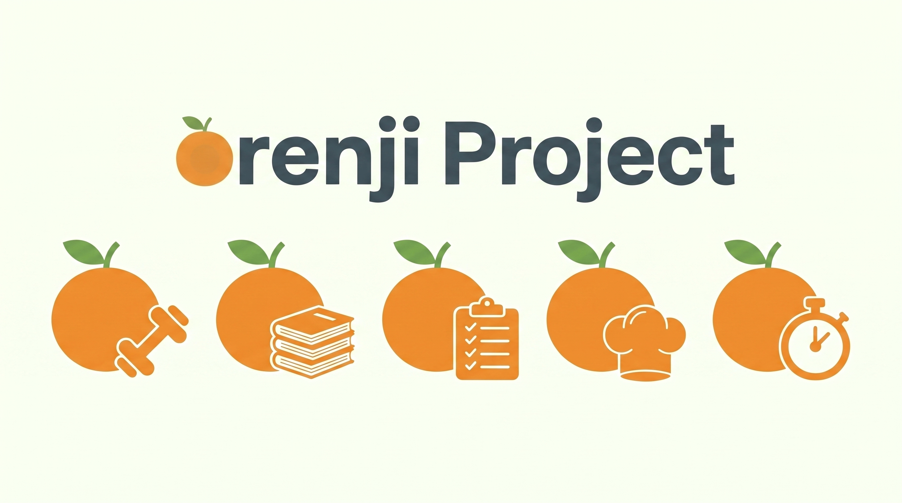
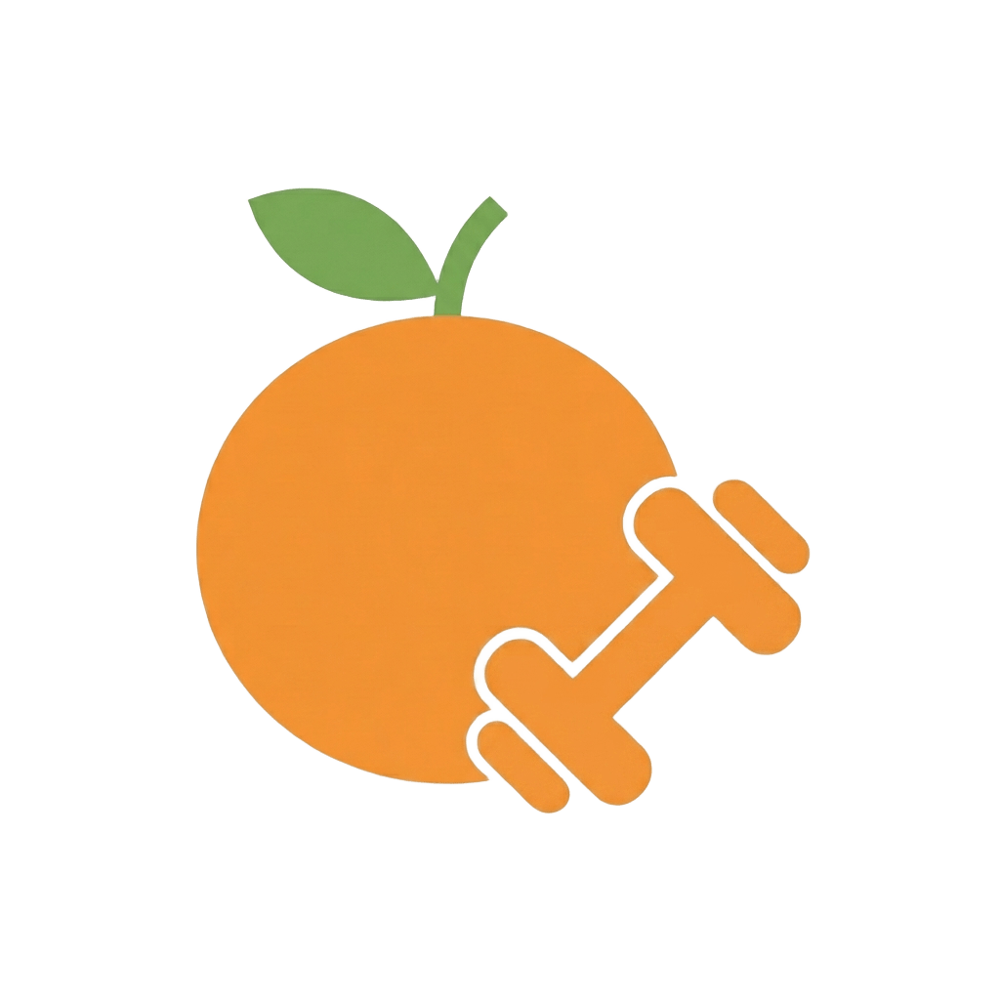
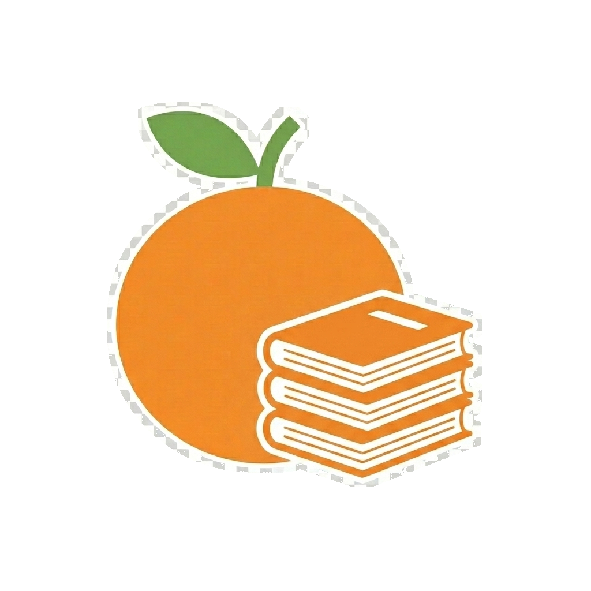
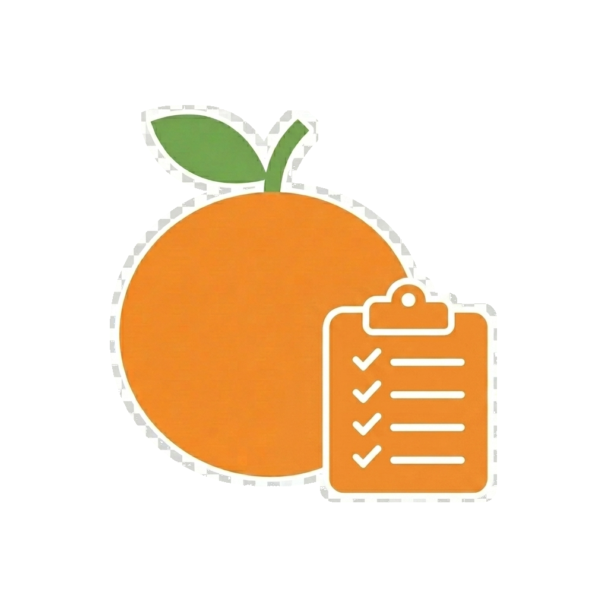
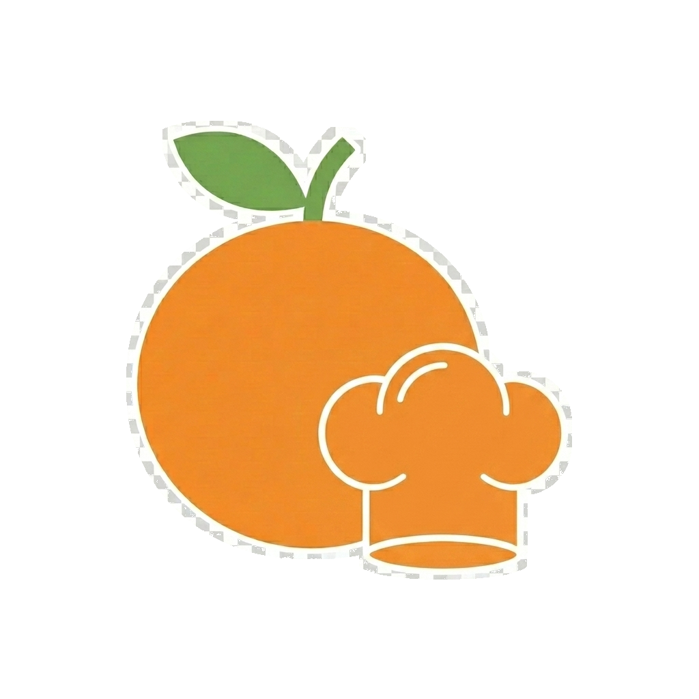
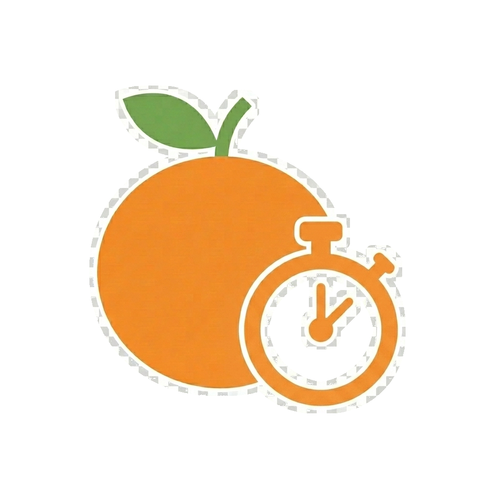

# Orenji Project

**Orenji Project** é um ecossistema de pequenas aplicacoes web criado como parte de um portfolio academico. O projeto junta varias areas do dia a dia, como estudo, receitas, foco, habitos e fitness, numa identidade visual comum inspirada no simbolo da laranja.

A ideia principal e simples: cada aplicacao pode funcionar de forma independente, mas todas partilham a mesma linguagem visual, a mesma base de organizacao e o mesmo objetivo de demonstrar competencias de desenvolvimento front-end com HTML, CSS e JavaScript.

---

## Identidade

O nome **Orenji** vem da palavra japonesa para "laranja" e foi escolhido para representar uma marca jovem, simples e reconhecivel. A laranja funciona como simbolo central do projeto: aparece nos logos, cria unidade entre as aplicacoes e ajuda a distinguir cada modulo atraves de pequenos elementos visuais.

Cada logo combina a laranja com um icone associado ao contexto da aplicacao:

<table>
  <tr>
    <td align="center" width="20%">
      
       
      <strong>Fitness</strong>
       
      Treinos, progresso e saude fisica.
    </td>
    <td align="center" width="20%">
      
       
      <strong>Study</strong>
       
      Organizacao de estudo, notas e materiais.
    </td>
    <td align="center" width="20%">
      
       
      <strong>Tasks</strong>
       
      Listas, tarefas e acompanhamento de progresso.
    </td>
    <td align="center" width="20%">
      
       
      <strong>Recipes</strong>
       
      Receitas, cozinha e exploracao de pratos.
    </td>
    <td align="center" width="20%">
      
       
      <strong>Focus</strong>
       
      Foco, tempo, produtividade e habitos.
    </td>
  </tr>
</table>

---

## Contexto do projeto

O Orenji Project nasceu como um conjunto de projetos para demonstrar capacidades praticas de desenvolvimento web num contexto de portfolio/PAF. Em vez de existir apenas uma aplicacao unica, o projeto foi organizado como uma familia de pequenas apps, cada uma com uma finalidade propria.

Esta estrutura permite mostrar varias competencias:

- Criacao de interfaces web com HTML, CSS e JavaScript.
- Organizacao de multiplos repositorios relacionados.
- Definicao de uma identidade visual consistente.
- Reutilizacao de estilos, componentes e assets comuns.
- Desenvolvimento de paginas estaticas com navegacao, layouts responsivos e interacoes simples.

---

## Aplicacoes

### Orenji Fitness

Aplicacao focada em treinos, resumo de atividade e configuracoes. Inclui agenda semanal, catalogo de treinos por categoria, registo de series/repeticoes/peso/duracao, historico de treinos, resumo de desempenho, metas semanais, mapa de foco muscular, temas visuais e exportacao/importacao de dados em JSON.

### Orenji Study

Aplicacao dedicada ao estudo, com dashboard, horario, notas, tarefas, calendario e configuracoes. Guarda aulas, notas, tarefas, eventos e preferencias no navegador, mantendo o contexto academico organizado num espaco unico.

### Orenji Tasks

Modulo associado a listas, prazos e prioridades dentro do Orenji Study. O logo com checklist representa planeamento, progresso e acompanhamento de objetivos escolares.

### Orenji Recipes

Aplicacao de receitas e cozinha, com paginas para pesquisa, favoritos, detalhe de receita, modo cozinha e configuracoes. O logo com chapeu de cozinheiro identifica o lado mais pratico e criativo da alimentacao.

### Orenji Focus / Habit

Area dividida em duas aplicacoes complementares: **Orenji Focus**, para produtividade e gestao de tempo com metodos como Pomodoro, Flowtime, 52/17 e Deep Work; e **Orenji Habit**, para rastrear habitos, sequencias, consistencia semanal e progresso visual. As duas apps partilham integracao atraves do modulo Orenji Shared.

### Orenji Styles

Repositorio base para estilos, temas, layout, animacoes, componentes e comportamento visual partilhado. A sua funcao e manter a consistencia visual entre as varias aplicacoes.

### Orenji Core

Repositorio reservado para documentacao, compatibilidade historica e fundacoes core que nao pertencam ao motor visual. A separacao do motor visual esta documentada no proprio repositorio.

---

## Repositorios

- `orenji-fitness-app` - aplicacao de fitness com dashboard, treinos, resumo e configuracoes.
- `Orenji-Study` - ferramentas de estudo, notas, tarefas, calendario e horario.
- `Orenji-Recipes` - aplicacao de receitas, favoritos, pesquisa e modo cozinha.
- `Orenji-Focus-Orenji-Habit` - area dedicada a foco, habitos, produtividade e integracao entre rotinas.
- `Orenji-styles` - motor visual partilhado.
- `Orenji-core` - documentacao e fundacoes core historicas.
- `.github` - perfil da organizacao e assets institucionais.

---

## Tecnologias

O projeto e desenvolvido principalmente com:

- HTML
- CSS
- JavaScript
- localStorage
- JSON

As aplicacoes foram pensadas para serem simples, acessiveis e faceis de demonstrar, com persistencia local no navegador e sem depender obrigatoriamente de back-end ou bases de dados.

---

## Objetivo academico

O Orenji Project tem como objetivo demonstrar competencias praticas de desenvolvimento front-end, design de interfaces e organizacao de projetos. As aplicacoes funcionam como exemplos de trabalho para portfolio, mostrando nao so paginas isoladas, mas tambem uma identidade visual coerente aplicada a varias ideias.

---

## Estado atual

O projeto encontra-se em desenvolvimento ativo e segue a estrutura consolidada:

- um projeto = um repositorio;
- `main` = versao estavel para apresentacao;
- `dev` = continuacao do desenvolvimento.

As principais prioridades sao:

- Melhorar a consistencia visual entre aplicacoes.
- Manter estilos e componentes partilhados no `Orenji-styles`.
- Adicionar documentacao individual a cada repositorio.
- Melhorar responsividade, acessibilidade e experiencia de utilizador.
- Preparar capturas de ecra e demonstracoes para apresentacao em portfolio.
- Continuar a aproximar Focus, Habit, Study, Recipes e Fitness atraves de dados locais, temas sincronizados e componentes partilhados.
