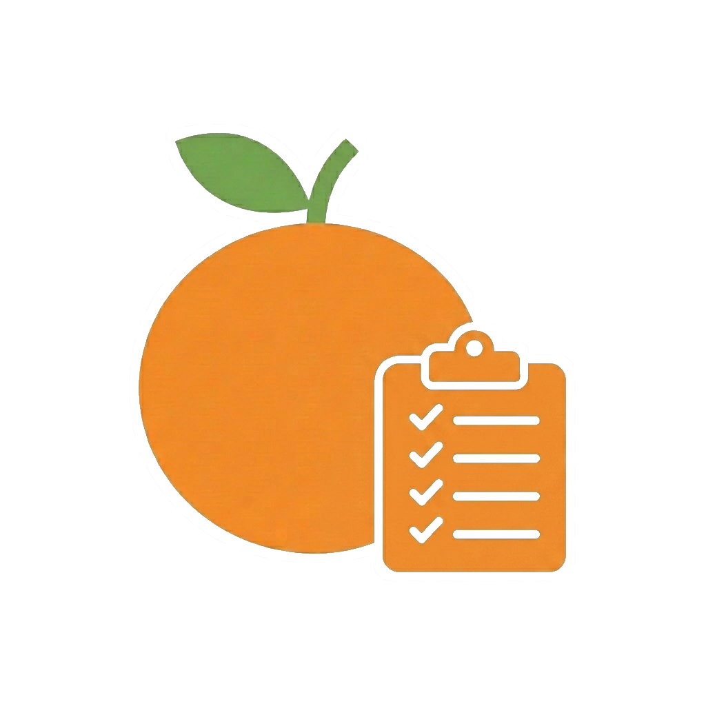

# Orenji Project

**Orenji Project** é um ecossistema de pequenas aplicações web criado como parte de um portefólio académico. O projeto junta várias áreas do dia a dia, como estudo, receitas, foco, hábitos e fitness, numa identidade visual comum inspirada no símbolo da laranja.

A ideia principal é simples: cada aplicação funciona de forma independente, mas todas partilham a mesma linguagem visual, a mesma base de organização e o mesmo objetivo de demonstrar competências de desenvolvimento front-end com HTML, CSS e JavaScript.

---

## Identidade

O nome **Orenji** vem da palavra japonesa para "laranja" e foi escolhido para representar uma marca jovem, simples e reconhecível. A laranja funciona como símbolo central do projeto: aparece nos logos, cria unidade entre as aplicações e ajuda a distinguir cada módulo através de pequenos elementos visuais.

Cada logo combina a laranja com um ícone associado ao contexto da aplicação:

<table>
  <tr>
    <td align="center" width="20%">
      
       
      <strong>Fitness</strong>
       
      Treinos, progresso e saúde física.
    </td>
    <td align="center" width="20%">
      
       
      <strong>Study</strong>
       
      Organização de estudo, notas e materiais.
    </td>
    <td align="center" width="20%">
      
       
      <strong>Recipes</strong>
       
      Receitas, cozinha e exploração de pratos.
    </td>
    <td align="center" width="20%">
      
       
      <strong>Focus</strong>
       
      Foco, tempo e produtividade.
    </td>
    <td align="center" width="20%">
      
       
      <strong>Habit</strong>
       
      Hábitos, consistência e progresso visual.
    </td>
  </tr>
</table>

---

## Contexto do projeto

O Orenji Project nasceu como um conjunto de projetos para demonstrar capacidades práticas de desenvolvimento web num contexto de portefólio/PAF. Em vez de existir apenas uma aplicação única, o projeto foi organizado como uma família de pequenas apps, cada uma com uma finalidade própria.

Esta estrutura permite mostrar várias competências:

- Criação de interfaces web com HTML, CSS e JavaScript.
- Organização de múltiplos repositórios relacionados.
- Definição de uma identidade visual consistente.
- Reutilização de estilos, componentes e assets comuns.
- Desenvolvimento de páginas estáticas com navegação, layouts responsivos e interações simples.

---

## Aplicações

### Orenji Fitness

Aplicação focada em treinos, resumo de atividade e configurações. Inclui agenda semanal, catálogo de treinos por categoria, registo de séries, repetições, peso e duração, histórico de treinos, resumo de desempenho, metas semanais, mapa de foco muscular, temas visuais e exportação/importação de dados em JSON.

### Orenji Study

Aplicação dedicada ao estudo, com dashboard, horário, notas, tarefas, calendário e configurações. Guarda aulas, notas, tarefas, eventos e preferências no navegador, mantendo o contexto académico organizado num espaço único.

### Orenji Habit

Aplicação dedicada ao acompanhamento de hábitos. Está separada do Focus e foca-se em sequências, consistência semanal, progresso visual e rotinas que ajudam a transformar pequenas ações em prática regular. O componente Tasks apoia a gestão de ações associadas aos hábitos.

### Orenji Recipes

Aplicação de receitas e cozinha, com páginas para pesquisa, favoritos, detalhe de receita, modo cozinha e configurações. O logo com chapéu de cozinheiro identifica o lado mais prático e criativo da alimentação.

### Orenji Focus

Aplicação dedicada à produtividade e gestão de tempo. Está separada do Habit e concentra-se em sessões de foco, métodos como Pomodoro, Flowtime, 52/17 e Deep Work, além de métricas simples para acompanhar tempo produtivo. O componente Tasks apoia a organização das tarefas ligadas a cada sessão.

### Orenji Styles

Repositório base para estilos, temas, layout, animações, componentes e comportamento visual partilhado. A sua função é manter a consistência visual entre as várias aplicações.

### Orenji Core

Repositório reservado para documentação, compatibilidade histórica e fundações core que não pertencem ao motor visual. A separação do motor visual está documentada no próprio repositório.

---

## Repositórios

- `orenji-fitness-app` - aplicação de fitness com dashboard, treinos, resumo e configurações.
- `Orenji-Study` - ferramentas de estudo, notas, tarefas, calendário e horário.
- `Orenji-Habit` - aplicação de hábitos, consistência e progresso visual.
- `Orenji-Recipes` - aplicação de receitas, favoritos, pesquisa e modo cozinha.
- `Orenji-Focus` - aplicação de foco, sessões produtivas e gestão de tempo.
- `Orenji-styles` - motor visual partilhado.
- `Orenji-core` - documentação e fundações core históricas.
- `.github` - perfil da organização e assets institucionais.

---

## Tecnologias

O projeto é desenvolvido principalmente com:

- HTML
- CSS
- JavaScript
- localStorage
- JSON

As aplicações foram pensadas para serem simples, acessíveis e fáceis de demonstrar, com persistência local no navegador e sem depender obrigatoriamente de back-end ou bases de dados.

---

## Objetivo académico

O Orenji Project tem como objetivo demonstrar competências práticas de desenvolvimento front-end, design de interfaces e organização de projetos. As aplicações funcionam como exemplos de trabalho para portefólio, mostrando não só páginas isoladas, mas também uma identidade visual coerente aplicada a várias ideias.

---

## Estado atual

O projeto encontra-se em desenvolvimento ativo e segue a estrutura consolidada:

- um projeto = um repositório;
- `main` = versão estável para apresentação;
- `dev` = continuação do desenvolvimento.

As principais prioridades são:

- Melhorar a consistência visual entre aplicações.
- Manter estilos e componentes partilhados no `Orenji-styles`.
- Adicionar documentação individual a cada repositório.
- Melhorar responsividade, acessibilidade e experiência de utilizador.
- Preparar capturas de ecrã e demonstrações para apresentação em portefólio.
- Continuar a aproximar Focus, Habit, Study, Recipes e Fitness através de dados locais, temas sincronizados e componentes partilhados.
